<div align="center">


# Skeptek 👁️
### Precision Optics for E-Commerce
*"The Minority Report for Online Shopping"*

[](https://ai.google.dev/)
[](https://nextjs.org/)
[](https://www.python.org/)
[](https://supabase.com/)

[**Launch Application**](https://vercel.com/snplmntns-projects/v0-skeptek) · [**Watch Demo**](#) · [**Report Bug**](https://github.com/snplmntn/skeptek/issues)

---
</div>

## 🚀 The Mission
**Skeptek** is an agentic analysis engine designed to cut through the noise of modern e-commerce. In an era of AI-generated reviews, dropshipped white-label garbage, and inflated pricing, Skeptek acts as your **Forensic Analyst**.

It doesn't just "search" for a product. It **investigates**. By deploying a swarm of specialized agents, Skeptek triangulates data from official retailers, Reddit discussion threads, and YouTube video hardware reviews to deliver a single, irrefutable **Truth Score**.

## 🧠 The Intelligence Engine
Skeptek utilizes a split-brain architecture powered by the **Gemini 3.0 Model Family**.

| Agent Role | Model Version | Capability |
| :--- | :--- | :--- |
| **The Judge** | **Gemini 3.0 Pro Preview** | Complex Reasoning, Verdict Synthesis, Cross-Referencing |
| **The Scouts** | **Gemini 3.0 Flash Preview** | High-Speed Grounding, Video Vision Analysis, Real-time Scraping |

### ITECTURE

```mermaid
graph TD
    User[USER QUEST] --> Lens[LENS CONTROLLER]
    Lens --> |Orchestrate| Swarm{AGENT SWARM}
    
    subgraph "The Scouts (Gemini 3.0 Flash)"
        Swarm --> Market[🕵️ MARKET SCOUT<br/>Google Grounding + Price Check]
        Swarm --> Video[🎥 VIDEO SCOUT<br/>Vision & Audio Analysis]
        Swarm --> Reddit[🛡️ REDDIT SCOUT<br/>Community Intel & Bot Filtering]
    end
    
    Market --> Evidence[RAW EVIDENCE]
    Video --> Evidence
    Reddit --> Evidence
    
    Evidence --> Judge[⚖️ THE JUDGE<br/>Gemini 3.0 Pro Preview]
    Judge --> Verdict[FINAL TRUTH SCORE]
```


## 🔍 How It Works
Our forensic pipeline works in four stages to ensure maximum accuracy:

1.  **Grounded Recon** 🔭
    *   We track down the product's **Original Launch Price (MSRP)** and compare it to current retailer prices.
    *   *Goal: Ensure you aren't paying a "hype tax" on aging tech.*

2.  **Visual & Audio Analysis** 🔬
    *   Our agents watch and listen to YouTube reviews. We detect **physical defects** in video frames (wobbly hinges, cheap plastic) and analyze spoken audio for complaints not listed in the specs.

3.  **Community Intel** 🛡️
    *   We combine **Skeptek Field Reports** with deep scans of Reddit.
    *   Our system filters out fake "bot" reviews, isolating genuine owner feedback.

4.  **The Verdict** ⚖️
    *   Every data point is fed to **The Judge (Gemini 3.0 Pro)**.
    *   You receive a Buy/Consider/Avoid rating and a detailed "Why" explanation.

## ✨ Key Features
*   **Lens Search**: A unified, "command-line" style input for rapid product investigation.
*   **Versus Mode**: Compare two products side-by-side with component-level analysis.
*   **Fairness Meter**: Algorithmic visualization of *Asking Price* vs. *Fair Market Value*.
*   **Review Gamification**: Earn **XP** and rank up from *Window Shopper* to *Skeptek God*.
*   **Hive Mind Memory**: Visual Hashing (SHA-256) and Canonical Aliasing ensure we never analyze the same product twice.

## 🏗️ System Architecture

```mermaid
graph TD
    User([User]) <--> Client[Next.js Frontend]
    Client <--> Orchestrator[Server Actions / Orchestrator]
    
    subgraph "Memory Core"
        Orchestrator <--> DB[(Supabase Postgres)]
        DB <--> Field[📝 Field Reports]
    end

    subgraph "Agent Swarm"
        Orchestrator --> Judge[⚖️ The Judge]
        Judge --> Market[🕵️ Market Scout]
        Judge --> Video[🎥 Video Scout]
        Judge --> Reddit[🌐 Reddit Scout]
        Field -.-> Judge
    end
    
    subgraph "Python Microservice"
        Market --> PyMarket[Selenium Scraper]
        Video --> PyVideo[yt-dlp + OpenCV]
        Reddit --> PyReddit[Headless Search]
    end
    
    subgraph "External World"
        PyMarket <--> WWW((Live Web))
        PyVideo <--> YT((YouTube))
        PyReddit <--> Red((Reddit))
    end
    
    subgraph "Gemini 3.0 Intelligence"
        Market -.-> GFlash[Gemini 3.0 Flash]
        Video -.-> GVision[Gemini 3.0 Flash Vision]
        Reddit -.-> GFlash
        Judge -.-> GPro[Gemini 3.0 Pro]
    end
    
    Judge ==> Verdict([Trusted Verdict])
    Verdict ==> Client
```



## 🛠️ Installation & Setup

### 1. Prerequisites
- **Node.js** (v18+)
- **Python** (v3.10+)
- **Supabase Account**
- **Google Cloud Platform Account**

### 2. Environment Variables
Create a `.env.local` file:
```bash
# Core AI Keys (Gemini 3.0)
GOOGLE_API_KEY=your_gemini_api_key

# Supabase (Database & Auth)
NEXT_PUBLIC_SUPABASE_URL=your_supabase_project_url
NEXT_PUBLIC_SUPABASE_PUBLISHABLE_DEFAULT_KEY=your_supabase_anon_key

# Python Microservice Connection
NEXT_PUBLIC_API_URL=http://localhost:8000
```

### 3. Run Locally
**Frontend (The Brain)**
```bash
npm install
npm run dev
```

**Backend (The Muscle)**
```bash
cd backend
pip install -r requirements.txt
python main.py
```

